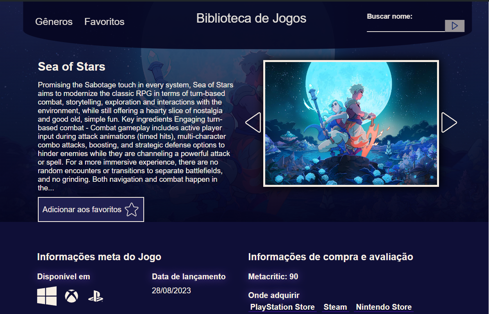
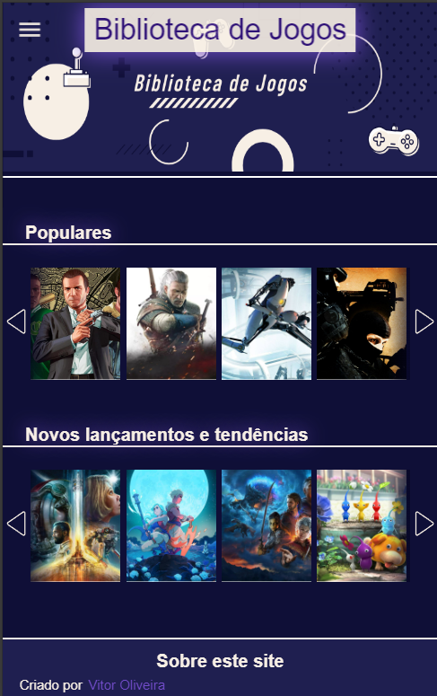
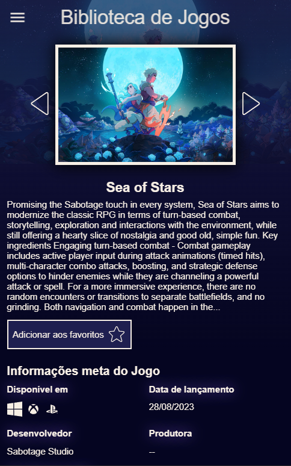

# Biblioteca de Jogos 🎮

O projeto Biblioteca de Jogos é um website desenvolvido em Angular, integrado com a API RAWG Video Games Database. Ele foi criado com o objetivo de proporcionar prática com o framework Angular e preparar para projetos similares encontrados no mercado. O foco está na otimização da componentização, design, funcionalidade do website, além da busca por uma integração eficiente com APIs.

## Recursos principais 🚀:

- Integração com a API RAWG Video Games Database para obter dados de jogos em tempo real.
- Design inovador
- Funcionalidades de busca por parâmetros à API.
- Capacidade de adicionar jogos aos favoritos.
- Utilização de cache para melhorar a performance e a experiência do usuário.
- Responsividade

## Acesse agora a demonstração em deploy na Vercel: [Deploy Vercel](https://biblioteca-de-jogos-angular-oliveiravitor32s-projects.vercel.app/)
# Prévia Desktop

    
    

# Prévia Mobile

  
  

# GameLibrary 🎮

This project was generated with [Angular CLI](https://github.com/angular/angular-cli) version 17.3.1.

## Development server

Run `ng serve` for a dev server. Navigate to `http://localhost:4200/`. The application will automatically reload if you change any of the source files.

## Code scaffolding

Run `ng generate component component-name` to generate a new component. You can also use `ng generate directive|pipe|service|class|guard|interface|enum|module`.

## Build

Run `ng build` to build the project. The build artifacts will be stored in the `dist/` directory.

## Running unit tests

Run `ng test` to execute the unit tests via [Karma](https://karma-runner.github.io).

## Running end-to-end tests

Run `ng e2e` to execute the end-to-end tests via a platform of your choice. To use this command, you need to first add a package that implements end-to-end testing capabilities.

## Further help

To get more help on the Angular CLI use `ng help` or go check out the [Angular CLI Overview and Command Reference](https://angular.io/cli) page.
